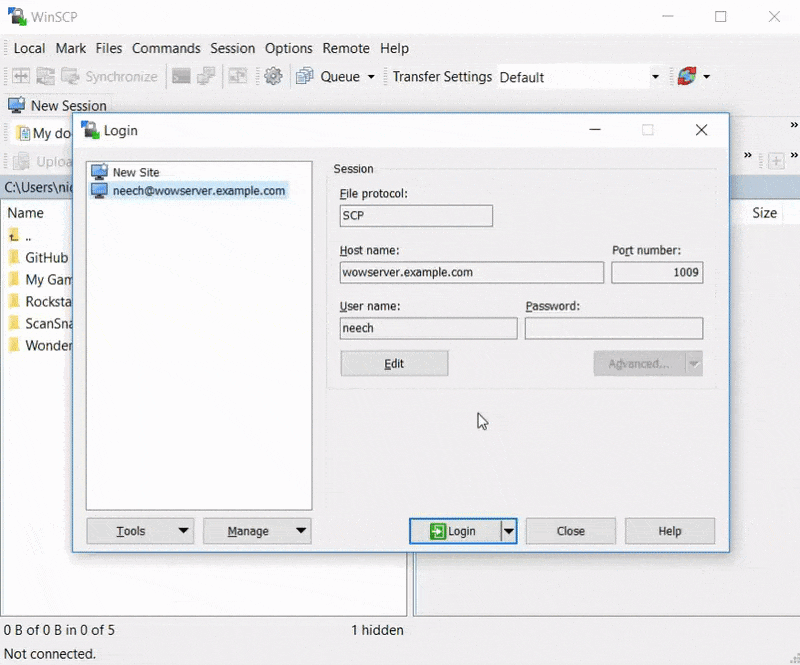

# Getting Started

First watch this video demonstration
https://www.youtube.com/watch?v=JmzZdexSYaM.

This guide will walk you through setting up a TrinityCore private WoW server for
Wrath of the Lich King (game client version 3.3.5a).

The default username and password will be: `trinity`.

## Requirements

You will need a Linux or OS X machine that has the following things installed:

  * `make`
  * `git`
  * Docker
  * `docker-compose` - Follow instructions at https://docs.docker.com/compose/install/

You will also need a *legitimate* copy of World of Warcraft: Wrath of the Lich
King (game client version 3.3.5a).

### Debian & Ubuntu

These required packages can be installed on Debian & Ubuntu by running the
following from your Linux shell:

    $ sudo apt-get install make git
    $ curl -sSL https://get.docker.com/ | sh

### CentOS & RedHat Enterprise Linux

These required packages can be installed on CentOS & RHEL by running the
following from your Linux shell:

    $ sudo yum install make git
    $ curl -sSL https://get.docker.com/ | sh

## Installation

You will need to preform 4 distinct steps in order to start your private
TrinityCore server, (and start playing on it).

  1. Compile the TrinityCore server.

  2. Generate the map data used by the `worldserver`. This will require a copy
     of the World of Warcraft game client files.

  3. Start the TrinityCore server.

  4. Configure your World of Warcraft game client, then connect to your
     TrinityCore private WoW server.

### Compiling TrinityCore

From your Linux shell, run the following:

    $ git clone https://github.com/neechbear/trinitycore
    $ cd trinitycore
    $ make build

Depending on the performance of your machine, this may take up to 1 hour to
complete.

The TrinityCore server should now be compiled inside of a Docker container. The
resulting build artifacts will be placed in to the `./artifacts/` sub-directory
in your current path.

### Generating Map Data

This process needs to read the data files from your copy of the World of Warcaft
game client.

You should copy your game client (usually in `C:\Program Files
(x86)\World of Warcraft\` on Windows, or `/Applications/World of Warcraft.app`
on OS X), in to a directory called `World_of_Warcraft` (using underscores
instead of spaces), under the `trinitycore` directory that you created in the
previous compile steps.

You can now run the next command to generate the map data.

    $ make mapdata

Depending on the performance of your machine, this may take up to 4 hours to
complete.

### Starting the TrinityCore Server

You are now ready to start your TrinityCore server.

The first time you start your server, it will create and import data in to the
MariaDB database. This may take a couple of minutes.

To start the server, simply run the following:

    $ make run

To stop the server, press `Control-C`.

You can now stop and start your TrinityCore server whenever you wish.

### Configuring your Game Client

As with any private WoW server, you will need to edit your `realmlist.wtf` file
in your `World of Warcraft\Data\enUS\` game client directory. Simply open the
file in your favorite text editor (or Notepad), and change the logon server to
be the IP address or hostname of the Linux machine that will be running your
TrinityCore server.

You can now launch your World of Warcraft game client, and login with the
default username `trinity` and password `trinity`.

The default `trinity` account has full Game-Master (GM) permissions. See
https://trinitycore.atlassian.net/wiki/display/tc/GM+Commands for a full list of
available commands.

Enjoy!

## Further Customisation

TODO: Describe the following here (while linking to as many pre-existing
TrinityCore forum and documentation resources as possible at the same time):

  * Connecting to TC-JSON-RPC on port 8081 (http://yourserver:8081/public/index.php/).
  * Connecting to Keira2 on port 8082 (http://yourserver:8082/Keira2/).
  * Inserting custom SQL before first `make run`.
  * Use of `worldserver` remote console.
  * Use of `worldserver` SOAP API.
  * Using `tcadmin`.
  * Launching the Docker swarm into the background as a daemon.
  * Changing `authserver.conf` and `worldserver.conf`.
  * Connecting to the MariaDB database.

## See Also

Related works by the same author:

  * https://github.com/neechbear/trinitycore-gce
  * https://github.com/neechbear/trinitycore
  * https://hub.docker.com/r/nicolaw/trinitycore
  * https://github.com/neechbear/tcadmin
  * https://neech.me.uk
  * https://nicolaw.uk/#WoW

Related TrinityCore projects and links:

  * https://trinitycore.atlassian.net/wiki/display/tc/GM+Commands
  * https://trinitycore.atlassian.net/wiki/display/tc/Installation+Guide
    * https://github.com/TrinityCore/
      * https://github.com/TrinityCore/TrinityCore
      * https://github.com/TrinityCore/aowow
  * https://github.com/Sarjuuk/aowow
    * https://db.rising-gods.de

